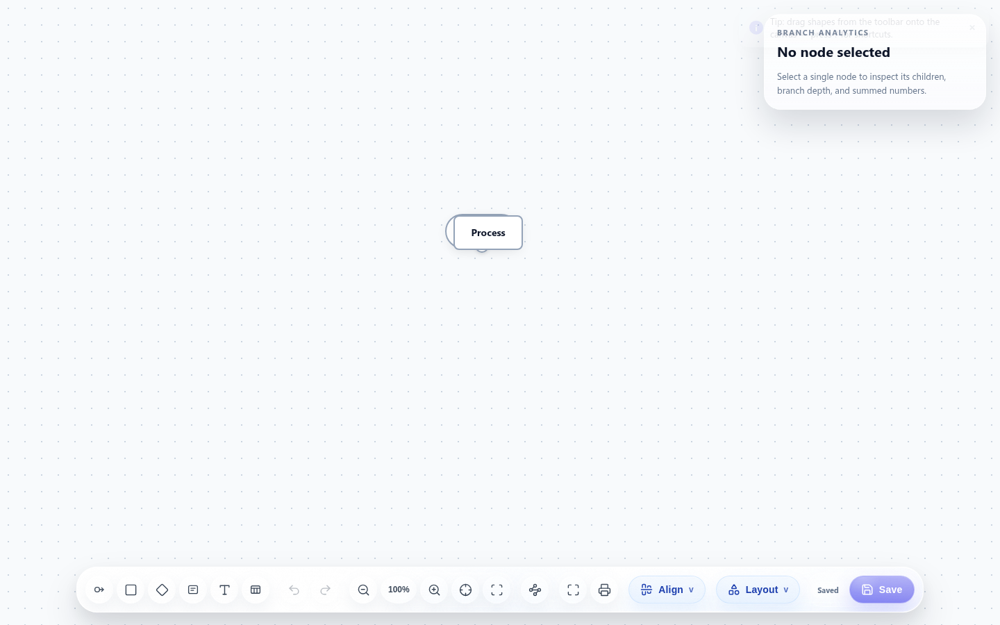

# Noodle 🍜

Offline-first flowchart and whiteboard that runs in your browser. No accounts, no install, no network required — open the page and start drawing.

**→ Try the live demo: [noodle.holistic.workers.dev](https://noodle.holistic.workers.dev/)**



## What it is

A hand-rolled flowchart editor with zero runtime dependencies:

- Hand-written node/edge engine, rendered directly in the DOM (no canvas, no library)
- Flowchart nodes (start/end, process, decision), groups, floating text, and tables
- Rich text inside nodes, connection labels, custom fills, branch analytics with metadata (price/date/time)
- Layouts (topological, tidy), align/distribute/compress, snap-to-grid, collapse/expand
- Export to JSON, SVG, and PNG; print support
- PWA with a service worker — full offline use after first load
- Boot-tested by loading the real app in jsdom (`test/boot.test.js`)

## Development

```bash
# run the boot tests (jsdom smoke test)
npm test

# lint
npm run lint
```

## Deploy to Cloudflare

The app is a static PWA — serve the repo root with any static host, or deploy to a Cloudflare Worker with static assets:

```bash
npx wrangler deploy
```

## Checks

```bash
npm test
npm run lint
```
